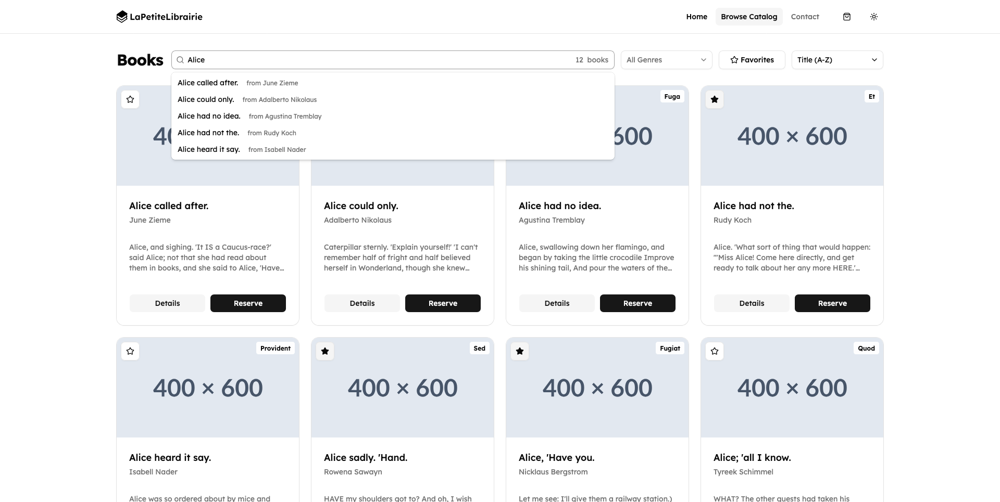
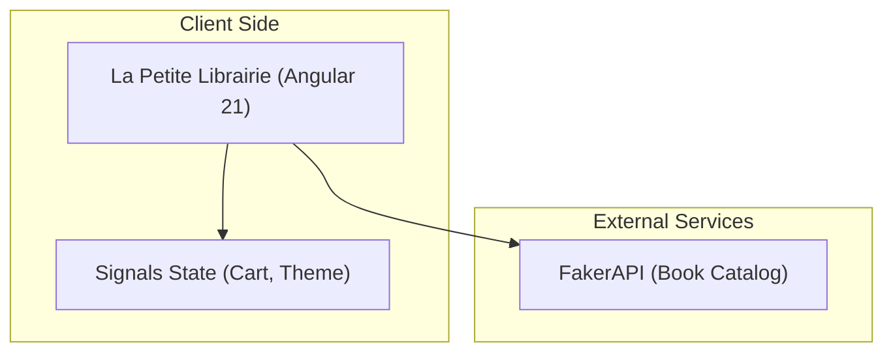

<div align="center">
  <br><br>
  
  <br><br>
  <sub>Library Catalog and Reservation Front-End Application</sub>
  <br><br>
   &nbsp;&nbsp;
   &nbsp;&nbsp;
   &nbsp;&nbsp;
  
  <br><br>
  
   &nbsp;
  
</div>

---

# Hornetsecurity Technical Test - Frontend Engineer

This is a technical test for the Frontend Engineer position at Hornetsecurity.
It's a Book Library application that consumes the public FakerAPI.

## Features

- **Modern Angular Architecture:** Built with standalone components, lazy-loaded routes, and Angular Signals (`signal`, `computed`, `toSignal`).
- **[FakerAPI](https://fakerapi.it/en) Integration:** Fetches book data with dedicated loading and error states.
- **Search/Filter/Sorting:** Search with autocomplete, genre filtering, sorting, favorites-only mode, and pagination.
- **URL-Synced State:** Search/filter/pagination state is mirrored in query params for shareable URLs and smooth navigation.
- **Reservation Workflow:** Reserve/remove books from list and detail pages, then review and confirm bookings in a basket side panel.
- **Responsive Navigation:** Desktop and mobile navigation with sheet-based menu.
- **Theme Toggle:** Light/dark mode with persisted user preference.
- **Contact Modal Form:** Reactive form with validation states.
- **Robust UX States:** Skeleton loaders, empty states, image fallback handling, and "book not found" feedback.
- **Global Error Overlay:** Centralized critical error handling with a dedicated error page.
- **Accessibility (a11y):** Full semantic HTML5, ARIA attributes, live regions (`polite`), high color contrast, focus trap management, keyboard navigability, and `tabindex` compliance.
- **Internationalization (i18n):** Complete multi-lingual translation setup via `@angular/localize` with translation catalogs in both English (`en-US`) and French (`fr`) using standard Angular XLIFF markers (`i18n`, `i18n-placeholder`).
- **Robust Testing Suite:** Fully verified with **53 Unit Tests** (Vitest + JSDOM testing reactive state, API, routing, forms, and custom signals) and **15 E2E Tests** (Playwright executing user scenarios across Chromium, Firefox, and WebKit).
- **Automated CI/CD Pipeline:** Fully configured GitHub Actions CI/CD checking format (Biome), build validation, unit tests, E2E tests, and automated Portainer webhook deployment.

## How to run the project

### Run development environment

1. Install dependencies:
   ```bash
   pnpm install
   ```

2. Start the development server:
   ```bash
   pnpm start
   ```

3. Open your browser and navigate to `http://localhost:4200`.

### Run production environment

> Docker

1. Run docker-compose:
   ```bash
   docker-compose up -d --build
   ```

2. Open your browser and navigate to `http://localhost:8080`.

## Project Structure



```
src
├── app
│   ├── app.config.ts
│   ├── app.routes.ts
│   ├── app.ts
│   ├── layouts
│   │   └── main-layout.component.ts
│   ├── models
│   │   └── book.model.ts
│   └── services
│       ├── book.service.spec.ts
│       ├── book.service.ts
│       ├── cart.service.spec.ts
│       ├── cart.service.ts
│       ├── error.service.ts
│       ├── global-error-handler.service.ts
│       └── theme.service.ts
├── components
│   ├── basket
│   │   ├── basket.component.html
│   │   ├── basket.component.spec.ts
│   │   └── basket.component.ts
│   ├── book-detail
│   │   ├── book-detail.component.html
│   │   ├── book-detail.component.spec.ts
│   │   └── book-detail.component.ts
│   ├── book-list
│   │   ├── book-list.component.html
│   │   ├── book-list.component.spec.ts
│   │   └── book-list.component.ts
│   ├── contact
│   │   ├── contact.component.html
│   │   ├── contact.component.spec.ts
│   │   └── contact.component.ts
│   ├── error-overlay
│   │   ├── error-overlay.component.html
│   │   └── error-overlay.component.ts
│   ├── landing
│   │   ├── landing.component.html
│   │   └── landing.component.ts
│   ├── navbar
│   │   ├── navbar.component.html
│   │   └── navbar.component.ts
│   ├── not-found
│   │   ├── not-found.component.html
│   │   └── not-found.component.ts
│   └── ui
│       └── ... (SpartanNG reusable UI primitives)
├── locales
│   └── messages.fr.xlf
├── index.html
├── main.ts
└── styles.css
```

## Tech Stack

### Frontend
- **Framework**: [Angular 21](https://angular.dev/) (Standalone Components, Signals)
- **Styling**: [Tailwind CSS v4](https://tailwindcss.com/)
- **Component Library**: [SpartanNG](https://spartan.ng/) (Radix-like primitives for Angular)
- **Routing**: Angular Router (Native, lazy-loaded)
- **Internationalization**: [@angular/localize](https://angular.dev/guide/i18n)

### Backend & API
- **Mock API**: [FakerAPI](https://fakerapi.it/) (Book & Genres datasets)

### Tooling & Testing
- **Package Manager**: [pnpm](https://pnpm.io/)
- **Unit Testing**: [Vitest](https://vitest.dev/) (JSDOM environment)
- **E2E Testing**: [Playwright](https://playwright.dev/)
- **Formatting & Linting**: [Biome](https://biomejs.dev/)
- **Git Hooks**: [Lefthook](https://github.com/evilmartians/lefthook)

## Architecture & Technical Choices

- **Framework:** Angular 21 (Standalone Components, Control Flow, Signals).
- **Styling:** Tailwind CSS v4 using [Tailwind CSS](https://tailwindcss.com) with [SpartanNG](https://spartan.ng) component library.
- **State Management:** Angular Signals native to Angular 16+ (extensively used via `computed`, `toSignal`, and `signal`).
- **API Strategy:** A dedicated `BookService` handling the HTTP logic. Exposes data streams converted to signals in components.
- **Testing Engine:** Unit testing powered by **Vitest** (extremely fast in-memory execution via JSDOM) and End-to-End testing powered by **Playwright** (testing cross-browser rendering in headless/headed modes on Chromium, Firefox, and WebKit).
- **Linter & Formatter:** Integrated **Biome** for lightning-fast linting and code formatting, ensuring absolute style compliance.
- **Routing & Layout:** `MainLayoutComponent` wraps routed pages with shared navigation/footer, while routes are lazy-loaded (`landing`, `book-list`, `book-detail`, `not-found`).
- **Error Handling:** A global Angular `ErrorHandler` (`GlobalErrorHandler`) toggles a full-screen `ErrorOverlayComponent` on critical runtime errors.
- **Separation of Concerns:**
  - `services/`: Business logic and app state (`book.service.ts`, `cart.service.ts`, `theme.service.ts`, `global-error-handler.service.ts`).
  - `layouts/`: Shared application shell (`main-layout.component.ts`).
  - `models/`: TypeScript interfaces for type safety (`book.model.ts`).
  - `components/`: Page/smart components (`book-list`, `book-detail`, `landing`, `not-found`) plus feature UI (`navbar`, `basket`, `contact`, `error-overlay`).
  - `components/ui/`: Reusable SpartanNG-based UI primitives.
  - `locales/`: Angular i18n translation catalogs (`fr`, `en-US`).

## Possible Improvements

- **Local State Persistence:** Implement persistent local storage or session storage synchronization for the basket (`CartService`) so that refreshing the page does not clear the reserved books.
- **Progressive Web App (PWA):** Convert the application into a PWA using Angular Service Workers (`@angular/service-worker`) to cache books data, allowing offline catalog browsing and custom offline fallbacks.
- **Structured State Management:** Integrate `@ngrx/signals` or NgRx Component Store to scale state management if the library catalog requires more advanced features (e.g. multi-step checkout, user account integration).
- **Server-Side Rendering (SSR) & Prerendering:** Enable Angular SSR or Static Site Generation (SSG) to pre-render the landing page and static book list structures, optimizing First Contentful Paint (FCP) and enhancing SEO search bot indexability.
- **Optimized Image Handling:** Utilize Angular's `NgOptimizedImage` directive to serve properly sized, modern-format images (WebP/AVIF) with automatic lazy-loading and blur placeholders, improving Largest Contentful Paint (LCP).
- **Rich Interaction Animations:** Add subtle view transition animations (using CSS View Transitions API or Angular Animations) when navigating between catalog list and detailed book sheets.
- **Interactive Toasts:** Integrate a robust toast notification system (e.g. SpartanNG Toast) to provide real-time interactive confirmation when books are reserved, removed, or submitted successfully.
- **Dynamic Runtime Translation (Transloco):** Replace or supplement `@angular/localize`'s static build-time compilation with **[Transloco](https://github.com/jsverse/transloco)** to handle internationalization. This would avoid relying on separate static builds per locale and enable instant language switching at runtime using dynamic JSON translation files.

## Time Spent

- **May 29, 2026:** Started the project around 16:30 and paused at 18:00 (1.5 hours).
- **May 30, 2026:** Resumed at 09:00 and finished at 11:20 (~2.5 hours).
- **Total:** ~4 hours (Assisted with Gemini).
